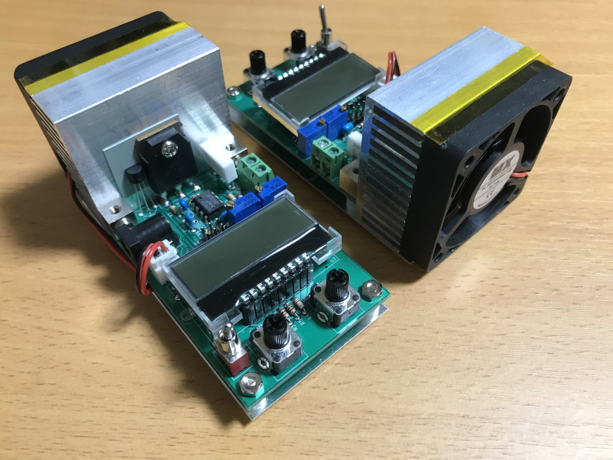
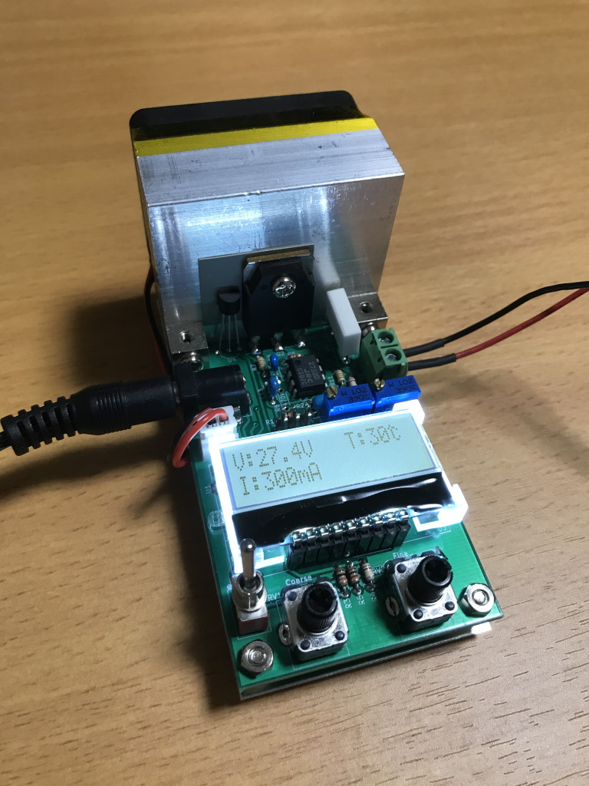

# Dummy Load 50V2A

ハードウェアプロジェクト**Dummy Load 50V2A**のデザインについてまとめます。

## 1. 概要

**Dummy Load 50V2A**は電源回路の負荷テストなどに便利な、定電流電子負荷装置です。
AVRマイコンを使用して電圧・電流・温度をモニタします。

* 最大定格DC50V、2A、50W程度
* 電圧モニタ分解能: 0.1V
* 電流モニタ分解能: 1mA
* 温度モニタ分解能: 1℃
* 電源: DC9～12V 100mA程度
* 動作中の電圧・電流・温度をモニタしながら、負荷電流をコース・ファインの2つのツマミで設定
* 負荷のON/OFFスイッチ

## 2. ツールとマテリアル

**ソフトウェアツール**
* 回路作図: [BSch3V](https://www.suigyodo.com/online/schsoft.htm) 0.83.05
* PCB設計: [KiCad](https://www.kicad.org/) 5.1
* ファームウェア開発: Atmel Studio 7 ([Microchip Studio 7](https://www.microchip.com/en-us/tools-resources/develop/microchip-studio))
* I2Cライブラリ: USI_TWI_Master ([TinyWireM](https://github.com/adafruit/TinyWireM))
* その他作図: [Inkscape](https://inkscape.org/) 1.1

**ハードウェアツール**
* AVRプログラマ: Atmel AVRISP mkIIまたは同等品
* 電圧計・電流計: 電圧と電流の読み取り値の比較基準に信頼できるものが必要です。とりあえず3 1/2桁のDMMでOKです。

**その他**
* ハンダとハンダゴテ、ニッパーとラジオペンチ、ヤスリ、タップとタップハンドル、等々
* スペーサー、ネジ、ワッシャー、アルミ板、等々

**※AVR開発環境のアップデート**
2022-05-31現在、AVRISP mkIIが既にディスコンということもあり、[MPLAB X IDE](https://www.microchip.com/en-us/tools-resources/develop/mplab-x-ide)と[MPLAB SNAP](https://www.microchip.com/en-us/development-tool/PG164100)への移行が良さそうです。Atmel Studioと同じ[Atmel AVR GNU Toolchain](https://www.microchip.com/en-us/tools-resources/develop/microchip-studio/gcc-compilers)も利用できるようです。

## 3. 回路の略解

[回路図](media/DummyLoad50V2A.pdf)
部品は概ね[秋月電子通商](https://akizukidenshi.com/)で購入できるものを中心に選んでいます。

**電子負荷**
オペアンプとMOSFETを使った電流シンクです。
オペアンプは単電源動作で0V入力できるものから広く選べますが、低オフセットのものが望ましいです。
MOSFETも特定の型番に限らず、定格電圧・電流、許容損失、熱抵抗、Vth(on)などの条件に見合ったものの中から広く選べると思います。

コース・ファインの2つのツマミで制御電圧を合成し、負荷電流を設定します。
回路図中480k～∞としている抵抗はオペアンプのオフセットを相殺するためのオプションであり、設定電流を0mAまで絞り込めない場合に追加します。

:bulb:このデザインは定電流負荷ですが、別のアイデアとして基準電圧をターゲット端子から取れば負荷電流が電圧に比例するオーム負荷となります。

**モニタ**
0～50Vの範囲を0.1Vの分解能で表示、オフセット調節を省略可、という条件で部品を選定しました。

* [AVR ATtiny85](https://www.microchip.com/en-us/product/ATtiny85)
* [外付け16bit 2ch ADC MCP3426](https://www.microchip.com/en-us/product/MCP3426)
* [温度センサ MCP9700A](https://www.microchip.com/en-us/product/MCP9700A)
* [LCDモジュール AQM1602Y-FLW-FBW](https://akizukidenshi.com/catalog/g/gP-12619/)

外付けADCを電圧・電流に、内蔵ADCを温度センサにそれぞれ割り当てます。  
AVRマイコンをLCDモジュールの真下に配置するために実装高さを抑え、[丸ピンＩＣソケット RI-01S-SG/4.2SMT](https://akizukidenshi.com/catalog/g/gP-12368/)を基板に埋め込むように実装します。

**ファームウェア**
内蔵のUSIユニットをI2C動作させるために、TinyWireMライブラリに同梱のUSI_TWI_Masterを利用します。TinyWireMはArduinoのライブラリですが、USI_TWI_MasterはArduinoに依存しません。

**放熱**
ヒートシンクの選択は厳密な熱設計に基づくものではありません。市販の電子負荷装置の中で定格50～100W程度のものに注目し、ワット当たりに必要なサイズを大雑把に見積もったものです。
Amazonで購入した詳細不明なアルミ製ヒートシンクと5cm角の12V DCファンを使用して、強制空冷としています。DCファンは3Dプリンタ向けの製品のようでした。

## 4. 組み立て

[ケガキ図](drawings/draft.svg)

ベースには50×100mm、t=1.0のアルミ板を使用しています。

1. パワーMOSFET以外の部品を基板に実装する。
2. 50mm角のヒートシンクにはM3タップを立て、10mm角の垂直取付用ブロックを使って基板と繋ぐ。
3. パワーMOSFETをヒートシンクに取り付け、基板にはんだ付けする。
4. 50×100mmのアルミ板ベースの上に5mmスペーサーを併用して基板とヒートシンクを固定する。
5. ヒートシンクにファンをテープで固定し、基板へコネクタを繋ぐ。
6. AVRマイコンとLCDを順にソケットに挿し込む。
7. AVRライタをISPピンヘッダに接続し、電源を接続してファームウェアを書き込む。
8. 適当な電圧・電流源を接続し、信頼できる電圧・電流計と表示値が一致するように多回転トリマをそれぞれ調節する。

